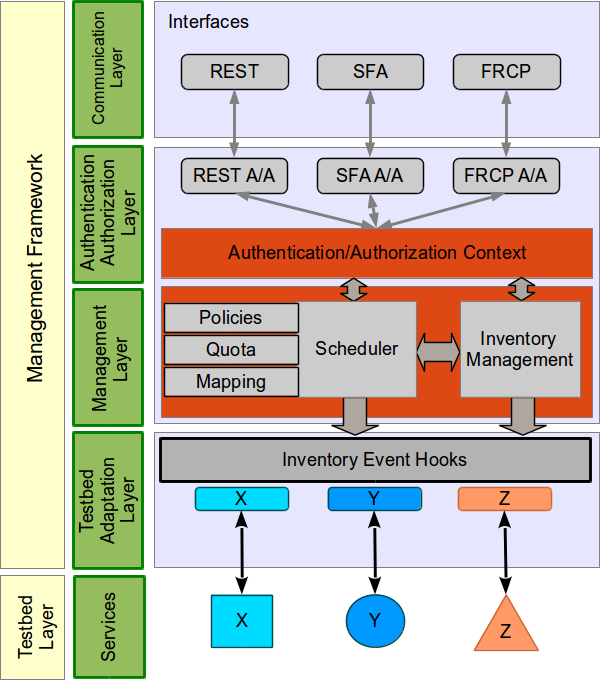

#Broker

The Broker is a framework for resource discovery, reservation and provisioning. Broker is able to control different kinds of testbeds.  

##Architecture Overview

Broker's architecture was thought to make it extensible and decoupled of testbed specificities. Figure 1 shows of diagram of Broker's architecture, exhibiting the layer division and the communication between them. An explanation of each layer is presented on the next sections. 

    
    

        Figure 1. Broker's architecture.
    

###Communication Layer

This layer has SFA, REST and FRCP communication interfaces. The SFA interface supports both version 2 and 3 of the SFA protocol. The REST interface is an alternative for SFA and allows more flexibility and the implementation of additional features. The REST interface also makes the implementation of Web portals easier. The FRCP interface is intended to make the interaction with RCs possible, in order to automate specifics testbed procedures (e.g. The EC can interact with Broker to ask if a user has permissions to create a Virtual Machine).

###Authentication/Authorization Layer

The Authentication/Authorization (A/A) layer is responsible for accepting or denying requests based on a A/A context. Each communitation interface receives a different credentials set, which requires the use of different mechanisms to deal with them.

###Management Layer

###Testbed Adaptation Layer
